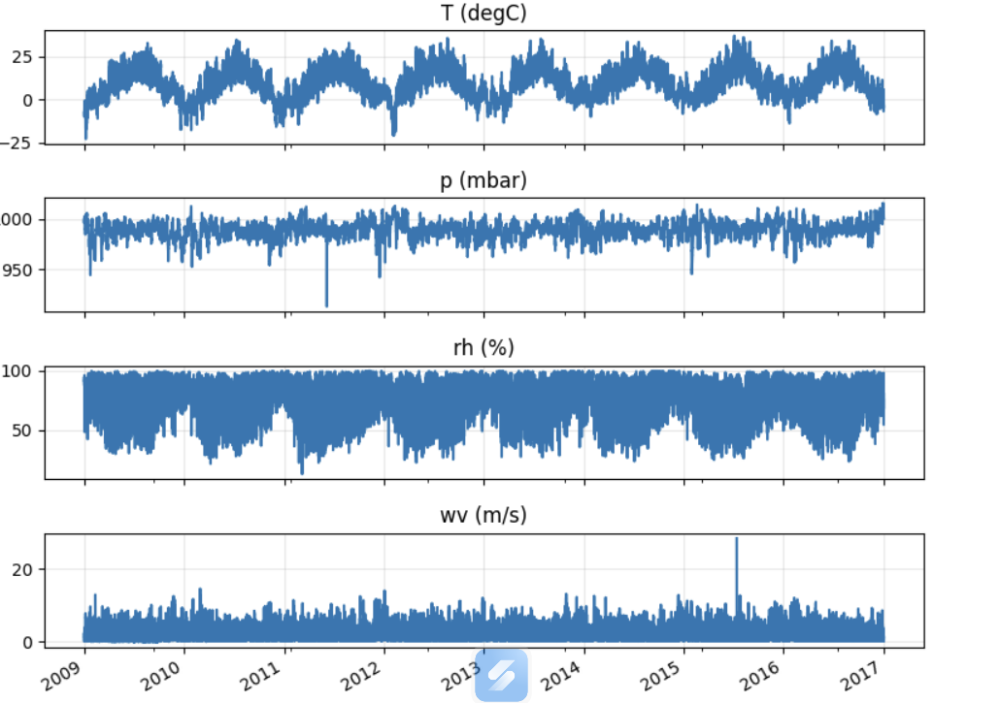
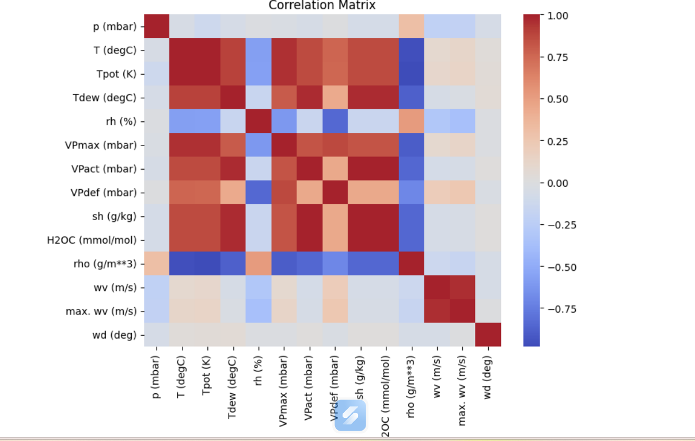
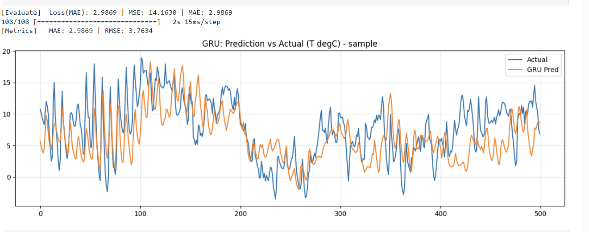
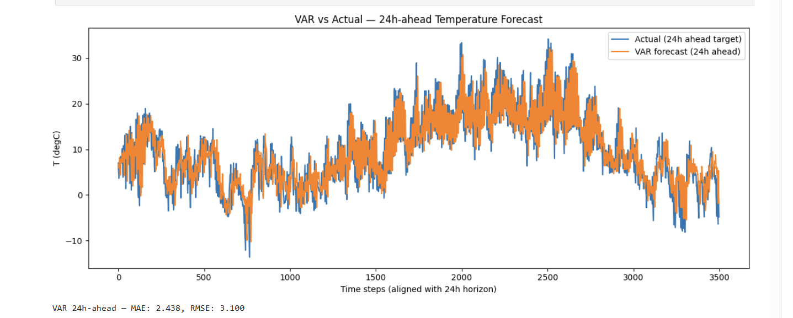
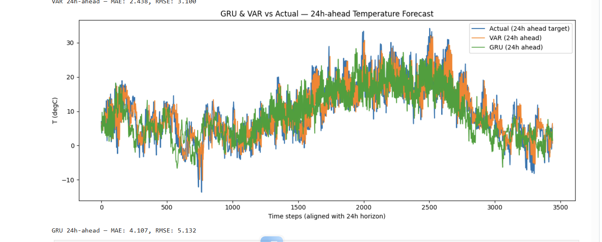

# Climate Forecasting: VAR vs. GRU

Short-term air-temperature forecasting at a **24-hour horizon** using a classical statistical model, **Vector Autoregression (VAR)**, and a deep-learning model, **Gated Recurrent Unit (GRU)**, on the **Jena Climate Dataset (2009–2016)**.

## Project Overview

Predicting meteorological variables is a multivariate time-series forecasting problem. This project evaluates whether a recurrent neural network can outperform a linear statistical benchmark when predicting air temperature 24 hours ahead from historical climate measurements.

The comparison is based on unseen test data and uses **Mean Absolute Error (MAE)** and **Root Mean Squared Error (RMSE)**.

## Objectives

- Clean and prepare multi-year meteorological time-series data.
- Downsample the original 10-minute observations to 3-hour intervals.
- Build input windows from historical climate measurements.
- Train a Vector Autoregression model as a statistical baseline.
- Train a Gated Recurrent Unit network for nonlinear forecasting.
- Compare both models using the same 24-hour prediction horizon.
- Evaluate generalisation on unseen test data using MAE and RMSE.

## Dataset

This project uses the **Jena Climate Dataset**, recorded by the Max Planck Institute for Biogeochemistry in Jena, Germany.

- **Period:** 2009–2016
- **Original frequency:** Every 10 minutes
- **Forecast target:** Air temperature, `T (degC)`
- **Forecast horizon:** 24 hours
- **Working frequency:** Every 3 hours

## Dataset Download

This project uses the Jena Climate Dataset (2009–2016).

### Original source

[Download the dataset from TensorFlow](https://storage.googleapis.com/tensorflow/tf-keras-datasets/jena_climate_2009_2016.csv.zip)

### Repository copy

[Download the ZIP file from this repository](https://raw.githubusercontent.com/reyhaneghaderi/multivariate-time-series-forecasting-of-temperature/main/data/raw/jena_climate_2009_2016.zip)

After downloading, extract the archive and place the CSV file at:

```text
data/raw/jena_climate_2009_2016.csv

After extracting the archive, place the CSV file at:

```text
data/raw/jena_climate_2009_2016.csv
```

The full dataset is not stored in this repository because of its file size.

## Selected Features

The models use the following meteorological variables:

- Atmospheric pressure: `p (mbar)`
- Air temperature: `T (degC)`
- Relative humidity: `rh (%)`
- Wind speed: `wv (m/s)`

Historical temperature is included as a predictor because past temperature values contain strong temporal information for short-term forecasting.

## Preprocessing Pipeline

### 1. Data cleaning

Invalid sentinel values such as `-9999` were replaced with missing values.

### 2. Missing-value treatment

Linear interpolation was applied to preserve a continuous time index.

### 3. Downsampling

The original 10-minute observations were reduced to 3-hour intervals. This decreases computational cost and reduces very high-frequency variation.

### 4. Feature selection

Redundant and strongly collinear variables were excluded to reduce unnecessary model complexity and multicollinearity.

### 5. Scaling

Numerical variables were normalised using `StandardScaler`.

### 6. Sequence construction

GRU inputs were converted into three-dimensional tensors:

```text
(samples, time steps, features)
```

The final input configuration was:

```text
Time steps: 56
Features: 4
Sliding step: 1
```

Because each observation represents 3 hours:

```text
56 × 3 hours = 168 hours = 7 days
```

Therefore, each GRU input contains seven days of historical measurements.

## Methodology

### Vector Autoregression

VAR is a classical multivariate statistical model in which all included variables are treated as endogenous.

- **Lag-selection criterion:** Akaike Information Criterion
- **Selected lag:** 24
- **Historical period represented by the lag:** 72 hours
- **Forecasting strategy:** Recursive 8-step prediction
- **Forecast horizon:** 8 × 3 hours = 24 hours

### Gated Recurrent Unit

The GRU model was designed to learn nonlinear temporal dependencies from the multivariate input sequence.

#### Architecture

- Two stacked GRU layers
- 128 units per GRU layer
- Recurrent dropout: 0.3
- Dense layers after the recurrent layers
- Final output layer for temperature prediction

#### Training

- Optimiser: Adam
- Learning rate: 0.001
- Loss function: MAE
- Maximum epochs: 100

## Results

| Model | Model type | MAE (°C) | RMSE (°C) | Result |
|---|---|---:|---:|---|
| VAR, lag 24 | Statistical multivariate model | **2.438** | **3.100** | Best test performance |
| GRU, 128 units | Deep recurrent neural network | 4.107 | 5.132 | Overfitting after the best validation epoch |

## Key Findings

### VAR achieved the strongest test performance

VAR produced lower MAE and RMSE than the final GRU model. This suggests that short-term temperature variation in this experiment contained strong linear autoregressive structure.

### The GRU model overfit

The GRU reached its best validation performance at approximately epoch 21, with validation MAE around `2.55 °C`. Continuing training to 100 epochs reduced its ability to generalise to the test set.

The result does **not** prove that GRU models are generally worse than VAR. It shows that, under this architecture and training procedure, the GRU model was not sufficiently regularised or stopped at its best validation point.

### Early stopping was necessary

The final GRU result demonstrates the importance of:

- early stopping;
- restoring the best model weights;
- tuning dropout and recurrent dropout;
- reducing model size when the architecture is unnecessarily complex;
- evaluating the best validation checkpoint instead of the final epoch.

## Visual Results

### Meteorological variables over time



### Correlation matrix



### GRU prediction versus actual temperature



### VAR 24-hour prediction versus actual temperature



### GRU and VAR comparison



## Repository Structure

```text
multivariate-time-series-forecasting-of-temperature/
│
├── README.md
├── requirements.txt
├── data/
│   └── raw/
│       ├── README.md
│       └── jena_climate_2009_2016.csv
│
├── notebooks/
│   └── temperature_forecasting.ipynb
│
└── results/
    └── figures/
        ├── meteorological_variables_time_series.png
        ├── correlation_matrix.png
        ├── gru_prediction_vs_actual.png
        ├── var_24h_prediction_vs_actual.png
        └── gru_var_vs_actual_24h_forecast.png
```

## Installation

Clone the repository:

```bash
git clone https://github.com/reyhaneghaderi/multivariate-time-series-forecasting-of-temperature.git
cd multivariate-time-series-forecasting-of-temperature
```

Install the required packages:

```bash
pip install -r requirements.txt
```

Start Jupyter Notebook:

```bash
jupyter notebook
```

Then open:

```text
notebooks/temperature_forecasting.ipynb
```

## Requirements

The project uses:

- Python
- pandas
- NumPy
- TensorFlow
- Matplotlib
- Seaborn
- scikit-learn
- statsmodels
- Jupyter

## Limitations

- The GRU was trained for 100 epochs without stopping at the best validation checkpoint.
- Only one GRU architecture was evaluated.
- Hyperparameter optimisation was limited.
- The comparison is based on one dataset and one forecast horizon.
- Recursive VAR forecasting may accumulate errors across multiple forecast steps.
- Strongly seasonal meteorological patterns may favour linear autoregressive models in this configuration.

## Future Improvements

- Add `EarlyStopping` with `restore_best_weights=True`.
- Add model checkpointing.
- Tune the GRU layer size, dropout, sequence length and learning rate.
- Compare GRU with LSTM, Temporal Convolutional Networks and Transformer-based models.
- Add persistence and seasonal-naive baselines.
- Evaluate performance across multiple forecast horizons.
- Report training time and computational cost.
- Perform rolling-origin cross-validation.
- Add confidence intervals or uncertainty estimates.

## Conclusion

The VAR model achieved the best test performance, with an MAE of `2.438 °C` and an RMSE of `3.100 °C`. The GRU model achieved an MAE of `4.107 °C` and an RMSE of `5.132 °C`.

The experiment shows that a more complex neural network does not automatically produce better forecasts. Careful validation, regularisation and checkpoint selection are essential. For this dataset and 24-hour forecast horizon, the linear VAR model provided the stronger and more reliable result.
